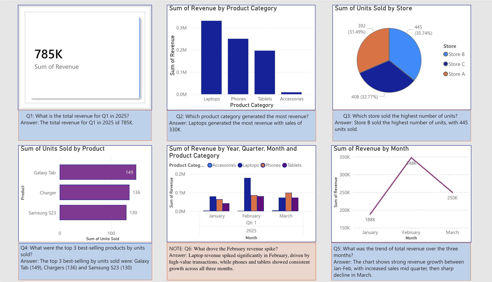
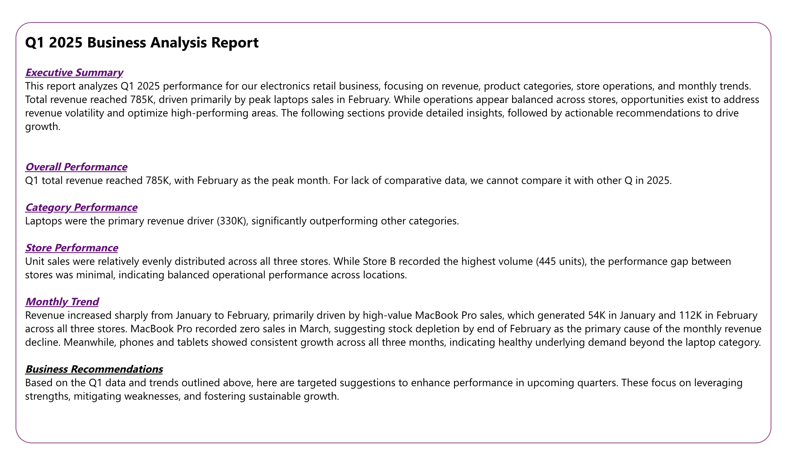
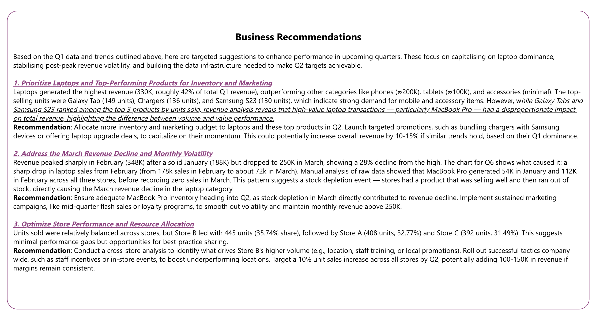
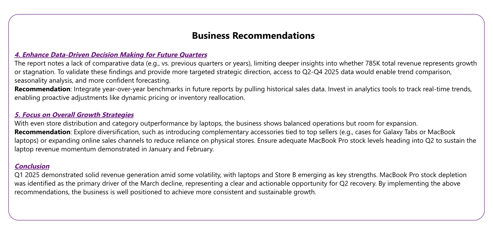

# Q1 2025 Retail Sales Analysis — Power BI

## Overview
Analysis of Q1 2025 sales data for an electronics retail business across three stores, covering January to March 2025. Built as part of the Generation UK Data Analytics Bootcamp.

## Key Findings
- Total Q1 revenue: £785K
- Laptops were the primary revenue driver (£330K, 42% of total)
- February revenue spike identified as driven by concentrated MacBook Pro sales (£112K in February alone)
- MacBook Pro recorded zero sales in March, indicating stock depletion as the primary cause of revenue decline
- Phones and tablets showed consistent growth across all three months
- Store performance was balanced across all three locations

## Tools Used
- Power BI Desktop
- Microsoft Excel (raw data analysis)

## Skills Demonstrated
- Data visualisation
- Root cause analysis beyond the brief
- Manual raw data interrogation
- Business recommendations with evidence-based reasoning

## Dashboard Screenshots

### Visuals Dashboard

### Business Executive Summary

### Business Recommendations (Part 1)

### Business Recommendations (Part 2)

